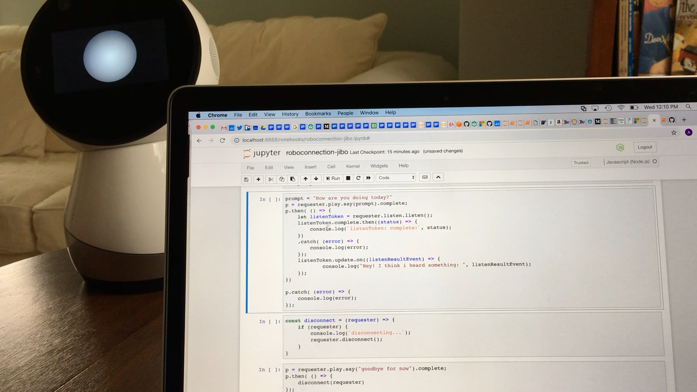
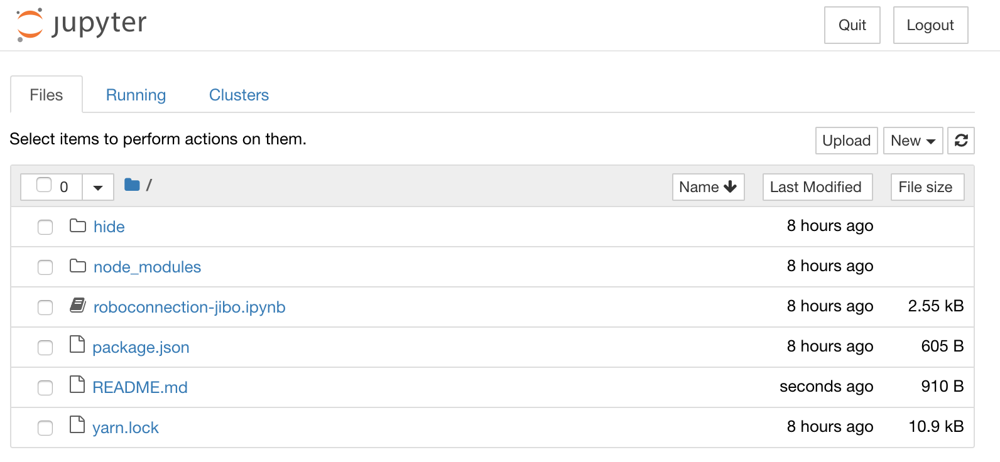

### roboconnection-jupyter

A juputer notebook for testing roboconnection.

[roboconnection-jibo.ipynb](./roboconnection-jibo.ipynb)


[Demo video](https://youtu.be/oy1xNLWU8Ms)

### installing
```
yarn
```

### prerequisites

**Install python3** (recommend anaconda)

- https://www.davidculley.com/installing-python-on-a-mac/
  - see: `The Preferred Approach Using Miniconda`

**Install jupyter**
```
conda install jupyter
```

**Install node** (recommend using `n` node version manager)

- https://www.npmjs.com/package/n?activeTab=readme

```
curl -L https://git.io/n-install | bash

```

**Install yarn** (optional)

- https://medium.com/@dtinth/i-recommend-another-way-to-install-yarn-30b3e7f73eed

```
curl -o- -L https://yarnpkg.com/install.sh | bash
```

**Install iJavascript** (JavaScript jupyter kernel)

```
npm install -g ijavascript
ijsinstall
```

### Run the roboconnection-jupyter notebook

```
git clone git@github.com:wwlib/roboconnection-jupyter.git
cd roboconnection-jupyter
ijsnotebook
```

Open: roboconnection-jibo.ipynb


